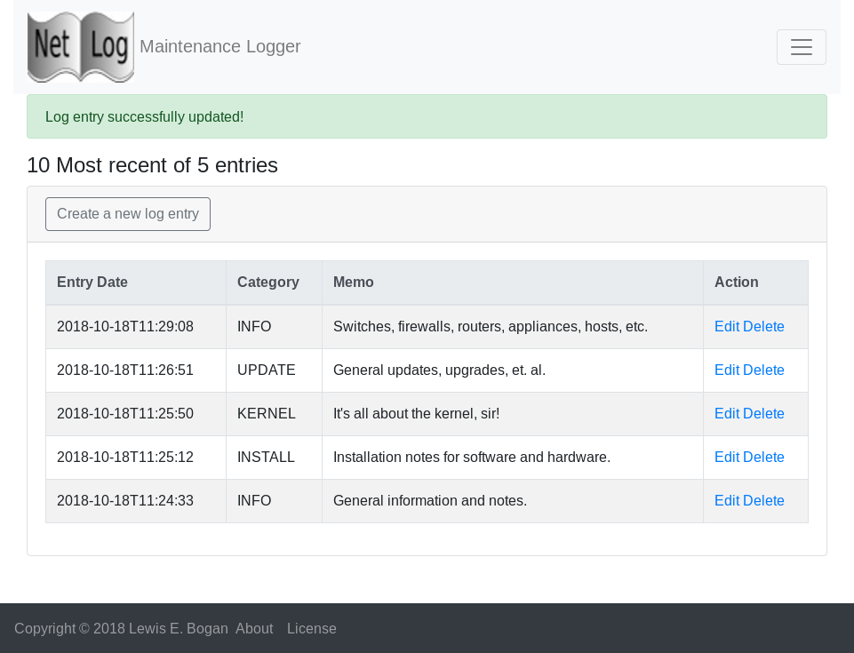

# netblog

**This app is currently in development, not ready for use yet!**

**Netblog** is a browser-enabled network maintenance log book. It
is actually a re-write of my command-line utility, **netlog**. As such, 
it can be used as a front-end for the existing netlog database - 
not meant to be published as a web site using Heroku or other services.

Why am I doing this?
- Not everyone uses the command-line
- Learn more Crystal and Kemal
- Add HTML, CSS, and Bootstrap to the learning mix
- Just have fun:-)  

Please, see the Disclaimer below.

## Installation

### Requirements
- Install `git` which may or may not be installed. Do that first.
- Install [Crystal](https://crystal-lang.org/docs/installation/)
according to your OS distribution if you are going to compile the source with
make. You will need additional development tools, such as make, to build
the app.

### Preferred Installation <a name="preferred-installation"></a>
Use the `install.sh` script provided. Although a Fedora-based binary is provided,
this insures that the app will work here in your environment. Batteries included.   
```bash
$ git clone https://github.com/lebogan/netblog.git
    or
$ git clone git@bitbucket.org:lebogan/netblog.git
$ cd netblog
$ ./install.sh
$ source ~/.bashrc (one time only)
```

#### Manual Installation
A Makefile is included for compiling and installing the binary and/or man pages.
Crystal is required to be pre installed. The binary is copied to `/usr/local/bin`.
The Makefile also provides for uninstalling and compilation cleanup. The compiled
binary is in `./bin`.

Pick your operating system here, [crystal-lang](https://crystal-lang.org/reference/installation/),
and follow the installation instructions.

```bash
$ git clone https://github.com/lebogan/netblog.git
    or
$ git clone git@bitbucket.org:lebogan/netblog.git
$ cd netblog
$ shards install
$ make
$ make test
$ sudo make install
```

```text
Add to `/.bashrc` these lines:
export DATABASE_URL=sqlite3:/home/<user>/netlog_db/netlog.db
export DB_DIR=/home/<user>/netlog_db
export SESSION_SECRET=`crystal eval 'require "random/secure"; puts Random::Secure.hex(64)'`
```

```bash
$ source ~/.bashrc (one time only)
```
To update, just do a `git pull`, `shards update`, and proceed as above.

#### Fedora
Since development was done on a Fedora workstation, a binary is provided for
direct usage.
```bash
$ git clone ssh://lewisb@devforge/var/lib/git/repos/gitme.git
$ cd gitme
$ ./install.sh
```
The installation script will symbolically link the program, gitme, to the 
location, `/usr/local/bin`.

To update, just run `install.sh` in the gitme directory. The script pulls a
fresh copy and since the app is symbolically linked, you're finished.

See also [Preferred Installation](#preferred-installation)

#### Debian/Ubuntu/CentOS/RedHat/Mac
The source will have to be recompiled with Crystal. Subsequent pulls of the repo
will have to be recompiled.

Pick your operating system here, [crystal-lang](https://crystal-lang.org/reference/installation/),
and follow the installation instructions.

See [Preferred Installation](#preferred-installation)

**Experimental**
A systemd service file has been included for automatically controlling the app as a 
service. Edit the file filling in the indicated entries, copy it to `/etc/systemd/system`
, reload the systemd daemon, and start/enable the service. See `SERVICE.md` for details.


## Usage
Here are some screenshots.

### Main Page


### Search Page


## TODO
[ ] - Add pagination to all listings  
[X] - Add edit/delet links on search results page  
[X] - Update to Bootstrap 4  
[X] - Move database to PostgreSQL  
[X] - Make installation script menu-driven

## Development
Please, see the Disclaimer below.

## Contributing
1. Fork it ( https://github.com/[your-github-name]/netblog/fork )
2. Create your feature branch (git checkout -b my-new-feature)
3. Commit your changes (git commit -am 'Add some feature')
4. Push to the branch (git push origin my-new-feature)
5. Create a new Pull Request

## Contributors
- [lebogan](https://github.com/lebogan/netblog.git) - creator, maintainer

## License
This utility is available as open source under the terms of the
[MIT License](http://opensource.org/licenses/MIT).

## Disclaimer
This utility was originally created for personal use in my work as a network
specialist. It was developed on a virtual Fedora Workstation using Crystal 0.28.0.
This has been tested on Fedora 28/28 Workstation. Painfully tested on 
Debian GNU/Linux 9 (stretch) 64-bit, Ubuntu 16.04 LTS, and Linux Mint 18.3 
Cinnamon 64-bit.

I am not a professional software developer nor do I pretend to be. I am a **retired** IT 
network specialist and this is a hobby to keep me out of trouble. If you 
use this application and it doesn't work the way you would want, feel free to 
fork it and modify it to your liking. Or, challange me to fix it;-).
Should be fun! Fork on GitHub at https://github.com/lebogan/netblog.git
