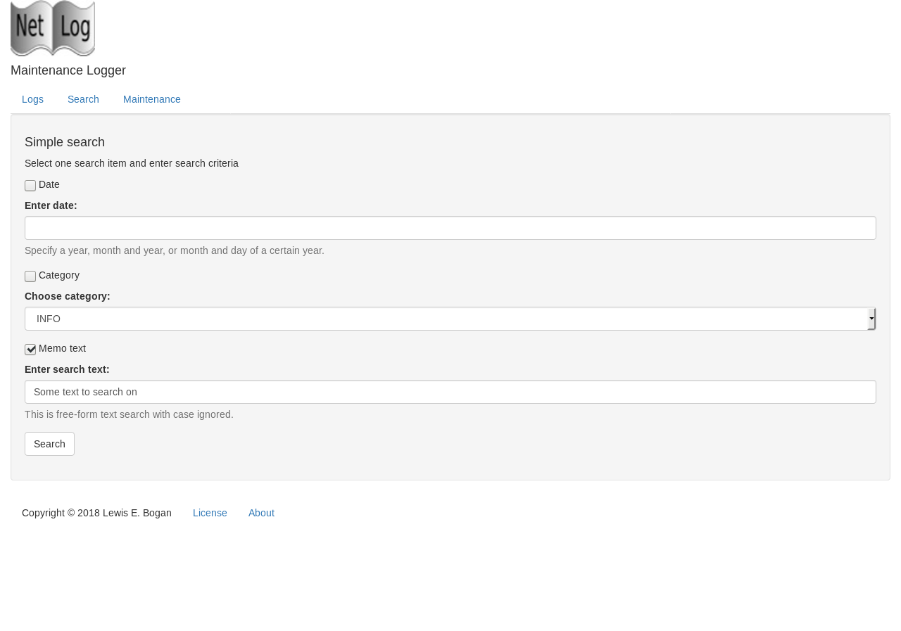
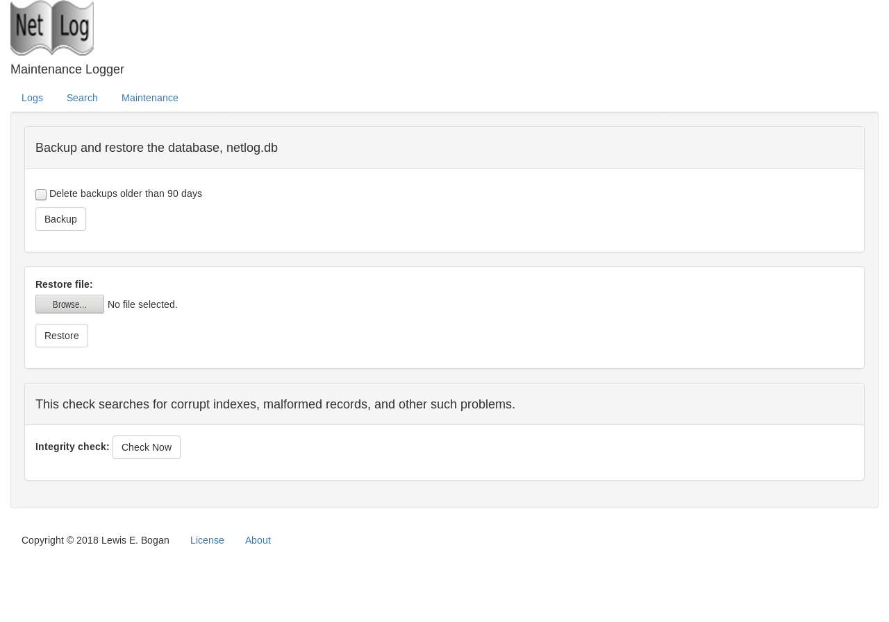

# netblog

**This app is currently in development, not ready for use yet!**

**Netblog** is a browser-enabled network maintenance log book. It
is actually a re-write of my command-line utility, **netlog**. As such, 
it can be used as a front-end for the existing netlog database - 
not meant to be published as a web site using Heroku or other services.

Why am I doing this?
- Not everyone uses the command-line
- Learn more Crystal and Kemal
- Add HTML, CSS, and Bootstrap to the learning mix
- Just have fun:-)  

Please, see the Disclaimer below.

## Requirements
The sqlite3 binary and sqlite3-dev(el) library are needed by the maintenance
function for backups, restores, and integrity checks. Make sure they are 
installed for your distribution and are a current version. There are additional
requirements for distros other than Fedora - which this was developed on.

## Installation

### Redhat/Fedora/CentOS

```bash
$ git clone https://github.com/lebogan/netblog.git
    or
$ git clone git@bitbucket.org:lebogan/netblog.git
$ cd netblog
$ ./install.sh
$ source ~/.bashrc (one time only)
```
The installation script will symbolically link the program, netblog, to the
location, /usr/local/bin. An empty database is installed in $HOME/netblog_db
if one doesn't already exist. Environment variables, DB_DIR and DATABASE_URL,and SESSION_SECRET
are added to .bashrc for exporting into the user's environment. Either `source .bashrc` 
or log out and back in. This is how the application finds the database.

To update, just run ***install.sh*** in the netblog directory. The script pulls a fresh
copy from GitHub or BitBucket and since the app is symbolically linked, you're finished.

**Experimental**
A systemd service file has been included for automatically controlling the app as a 
service. Edit the file filling in the indicated entries, copy it to `/etc/systemd/system`
, reload the systemd daemon, and start/enable the service. See `SERVICE.md` for details.

> ### Installation on Ubuntu
> The compiled binary will not run on Ubuntu as is. It complains about libpcre.so.1 
> not being available. It will have to be compiled with Crystal which may or may not
> be [installed](https://devdocs.io/crystal/docs/installation/on_debian_and_ubuntu).
> There may also be a complaint about libssl.so.1.1 not being found.
>
> The below instructions can be used in a shell script. Be sure that at least git
> is installed. I have run into instances where it is not:
> ```bash
> $ sudo apt-get install git curl build-essential sqlite3 libsqlite3-dev
> $ curl https://dist.crystal-lang.org/apt/setup.sh | sudo bash
> $ sudo apt-get install crystal
> $ locate libssl.so
> /lib/x86_64-linux-gnu/libssl.so.1.0.0
> /usr/lib/x86_64-linux-gnu/libssl.so
> $ export LD_LIBRARY_PATH=/lib/x86_64-linux-gnu/:/usr/lib/x86_64-linux-gnu/
> $ sudo ldcongig
> $ git clone https://github.com/lebogan/netblog.git
> $ cd netblog
> $ shards install
> $ crystal build --release src/netblog.cr
> $ ./install.sh
> $ source ~/.bashrc (one time only)
> ```
> Subsequent pulls for upgrading will require that the shards be updated and 
> the binary recompiled.

> ### Debian and Mint
> Both also complain about libssl in addition to libz. Install as indicated 
> below and then follow the Ubuntu instructions. You may not need to
> export the LD_LIBRARY_PATH. Debian 9 really complains about the ssl stuff(it's
> all about libssl1.0-dev, crystal-lang issue - `crystal doesn't work with OpenSSL 1.1.0f (Debian 9) #4680`)
> ```bash
> $ sudo apt install zlib1g-dev libssl-dev libssl1.0-dev
> ```
> Subsequent pulls for upgrading will require that the shards be updated and 
> the binary recompiled.

## Usage
Here are some screenshots.

### Main Page


### Search Page


### Maintenance Page


## TODO

[ ] - Add pagination to all listings  
[X] - Add edit/delet links on search results page
[ ] - Update to Bootstrap 4

## Development

Please, see the Disclaimer below.

## Contributing

1. Fork it ( https://github.com/[your-github-name]/netblog/fork )
2. Create your feature branch (git checkout -b my-new-feature)
3. Commit your changes (git commit -am 'Add some feature')
4. Push to the branch (git push origin my-new-feature)
5. Create a new Pull Request

## Contributors
- [lebogan](https://github.com/lebogan/netblog.git) - creator, maintainer

## License
This utility is available as open source under the terms of the
[MIT License](http://opensource.org/licenses/MIT).

## Disclaimer
This utility was originally created for personal use in my work as a network
specialist. It was developed on a virtual Fedora Workstation using Crystal 0.25.1.
This has been tested on Fedora 26/27/28 Workstation. Painfully tested on 
Debian GNU/Linux 9 (stretch) 64-bit, Ubuntu 16.04 LTS, and Linux Mint 18.3 
Cinnamon 64-bit.

I am not a professional software developer nor do I pretend to be. I am a **retired** IT 
network specialist and this is a hobby to keep me out of trouble. If you 
use this application and it doesn't work the way you would want, feel free to 
fork it and modify it to your liking. Or, challange me to fix it;-).
Should be fun! Fork on GitHub at https://github.com/lebogan/netblog.git
